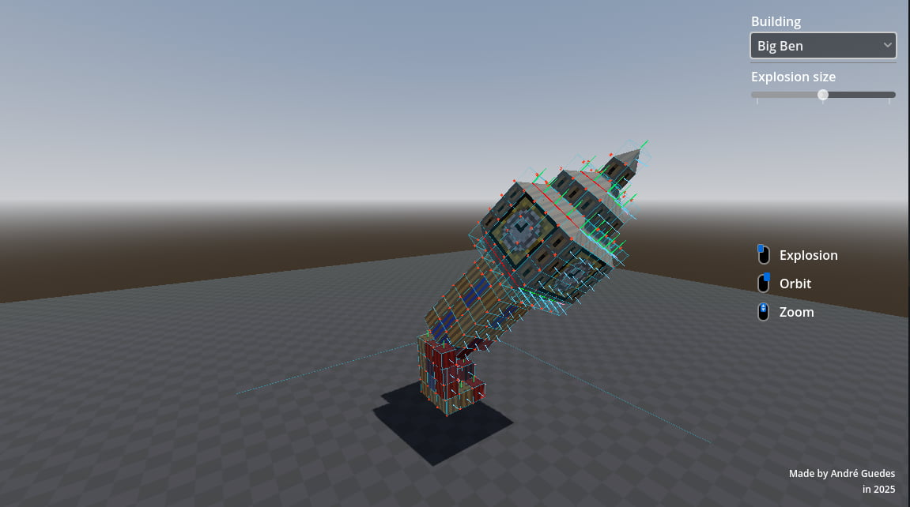
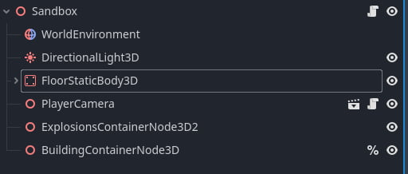
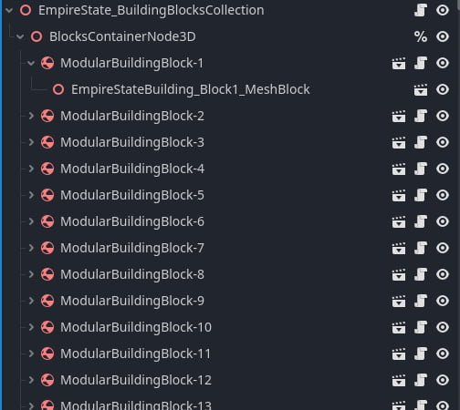
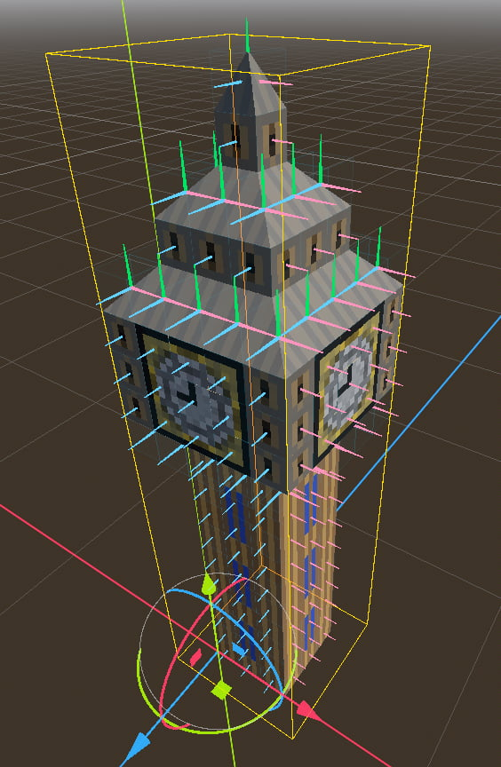
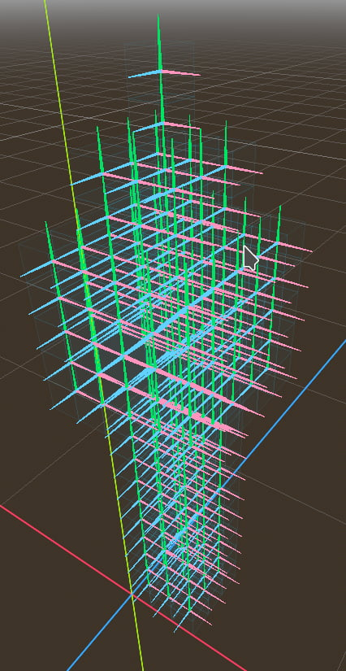
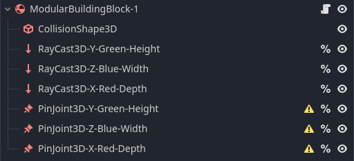
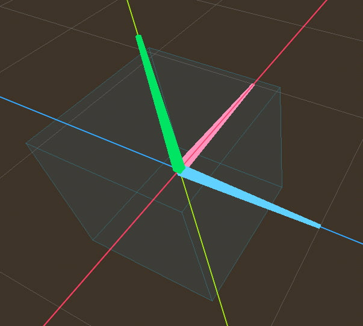
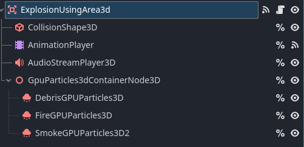
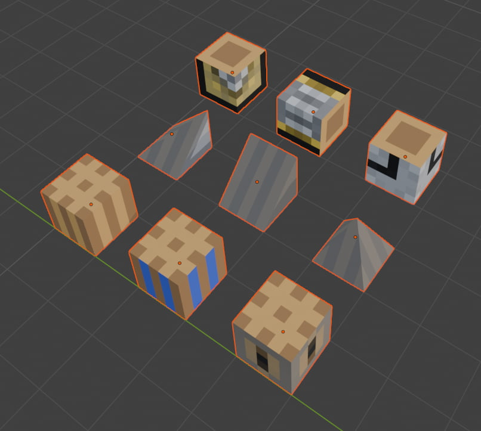

After playing [X-Morph: Defense](https://store.steampowered.com/app/408410/XMorph_Defense/), I was impressed by the mechanic of destroying parts of buildings, and the collapse of the different sections of the building.

Discovering the [Creating fully destructible cities while maintaining 60FPS](https://www.gamedeveloper.com/design/creating-fully-destructible-cities-while-maintaining-60fps), helped understanding how to build a system like this, so this is my **simplified** version of this system in Godot.

## Web demo

You can play with the interactive demo available at [GitHub Pages](https://crei0.github.io/building-teardown/)

The entire project and source code is available on [GitHub](https://github.com/crei0/building-teardown)

## Main node structure inside Godot

### `PlayerCamera`

* Deals with player's input
* Generating the explosions
* Showing the user interface
* Deals with `Camera3D` zooming and orbiting

### `ExplosionsContainerNode3D`

* Where the explosions child nodes are instantiated

### `ExplosionsContainerNode3D`

* Where the building scenes are instantiated

## Building hierarchy

Each building scene, is a `Scene` with the custom class `BuildingBlocksCollection`, this class has nothing in it, so it could be easily removed.

Inside it there's a container `Node3D`, just to keep things more organized and to be easier to change things in the future.

### ModularBuildingBlock

Inside the container `Node3D`, it's where each block of the building lives. Each is a custom class `ModularBuildingBlock` (extending `RigidBody3D`). 

When I setup a building, for each block/section I add a `ModularBuildingBlock` node, and inside it I place the `MeshBlock` (the visible 3D mesh).

And it ends up looking like this inside the editor

And this is how it looks without the meshes

#### How `ModularBuildingBlock` works

The custom class uses a `RigidBody3D` and its `CollisionShape3D` to deal with the collisions. The collision shape used are always the 3d cube, even for roofs/slopes/other 3d mesh types.

The cube on the image above is the cube shaped `CollisionShape3D`.

The 3 `RayCast3D` visible in colour (light green for `height`, pink for `depth` and light blue for `width`) nodes are used to detect if there are other neighbours.

And if a neighbour is detected the corresponding `PinJoint3D` (in this scene) is configured with the `NodePath` of this scene (as `node_a`), and the `NodePath` of the other `ModularBuildingBlock` (as `node_b`).

This detection of the the neighbours is done once after `ready()` phase of the Node lifecycle

##### Examples

If there's a neighbour in the `RayCast3D-X-Red-Depth` axis, then the `PinJoint3D-X-Red-Depth` node will have as `node_a` the `NodePath` of this `ModularBuildingBlock-1`, and as `node_b` the `NodePath` of the neighbour `ModularBuildingBlock-2` (for example).

If for example, there's no neighbour in light blue/`width` axis is not detected by `RayCast3D-Z-Blue-Width`, then the `PinJoint3D-Z-Blue-Width` will **have** it's `node_a` and `node_b` as `null`/empty string.

## Exploding sections of the building

Each `ModularBuildingBlock` has a `health` variable, if the health is `0` or lower, then the block simply is removed from the scene.

For the blocks that are damaged but survive an explosion, a `StandardMaterial3D` material exists on the `MeshBlock`, and its albedo color is changed from white (being completely transparent) to `red` if the block is heavily damaged.

The node used for the explosions (`ExplosionUsingArea2d`) is an `Area3D`, and when the explosion is triggered in a world position, the `Area3D` detects the `ModularBuildingBlock` inside its `CollisionShape3D` and calls the `damage_from_explosion_position()` inside each block.

Depending on the distance to the explosion center, the damage is calculated.

On the `UI` there's a slider to change the size of the explosions.

The explosion particle VFX is done using 3 `GPUParticles3D`, one for the `debris`, one for the `fire` and the last one for the `smoke clouds`, all this is triggered using an `AnimationPlayer`.

## Blender

When I want to create a new building, I start first in Blender.

I stack `1mx1mx1m` cubes in Blender to get the overall shape, after that I create individual meshes for each important 3D feature of the building.

Below all the 3D meshes created for the `BigBen`

The first line of 3 cubes, are just normal cubes used for the walls.

The second line of meshes, are used for the roofs. The first and second from right to left are rotated to be used as 'slopes' (for that section that comes out of the building, below the clock).

Even though these are non-cube meshes, inside the physics simulation they still have cube shaped `CollisionShape3D`.

The last 3 cubes are used on the clock, and rotated as needed.

### Texture

The texture was created in Figma, created in way to be low resolution/pixel art.
